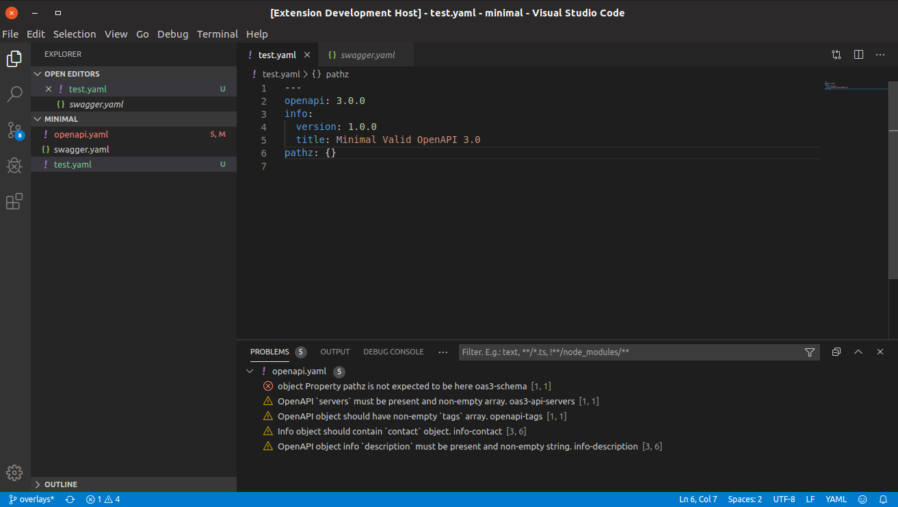

# Spotlight Linter for VS Code

> **Spotlight for VS Code** is an [API Commons](https://github.com/api-commons)
> fork of [Stoplight's vscode-spectral](https://github.com/stoplightio/vscode-spectral).
> It is the editor companion to [spotlight-cli](https://github.com/api-commons/spotlight-cli)
> (the linter) and [spotlight-spec](https://github.com/api-commons/spotlight-spec)
> (the standalone ruleset specification). The extension still embeds the upstream
> Spectral linter engine — see [FORK.md](./FORK.md) for what was rebranded and
> what was kept for compatibility.

The Spotlight VS Code extension brings API linting — powered by the Spectral
engine it embeds — to your favorite editor.

It is a flexible object linter with out of the box support for
[OpenAPI](https://openapis.org/) v2 and v3, [Arazzo](https://www.openapis.org/arazzo),
[JSON Schema](https://json-schema.org/), and [AsyncAPI](https://www.asyncapi.com/)
v2 and v3.

## Features

- Lint-on-save
- Lint-on-type
- Custom ruleset support (`.spectral.json`, `.spectral.yaml`, `.spectral.yml` or `.spectral.js`)
- Intellisense for custom ruleset editing
- Support for JSON and YAML input



## Requirements

- Node.js ^12.21 or >=14.13
- Visual Studio Code version 1.48 or higher.

## Installation

This fork is not published to the Visual Studio Code Marketplace. Build and
install it locally:

```bash
yarn install
node make.js package   # webpack-builds client + server and runs `vsce package` (see make.js)
code --install-extension artifacts/<the-generated>.vsix
```

The extension ID is `api-commons.spotlight`.

## Extension Settings

This extension contributes the following settings:

- `spotlight.enable`: Controls whether or not Spotlight is enabled.
- `spotlight.rulesetFile`: Location of the ruleset file to use when validating. If omitted, the default is a `.spectral.(json|yaml|yml)` in the same folder as the document being validated. Paths are relative to the workspace. This can also be a remote HTTP url.
- `spotlight.run`: Run the linter on save (`onSave`) or as you type (`onType`).
- `spotlight.validateFiles`: An array of file globs (e.g., `**/*.yaml`) which should be validated by Spotlight. If language identifiers are also specified, the file must match both in order to be validated. You can also use negative file globs (e.g., `!**/package.json`) here to exclude files.
- `spotlight.validateLanguages`: An array of language IDs (e.g., `yaml`, `json`) which should be validated by Spotlight. If file globs are also specified, the file must match both in order to be validated.

## Thanks

This extension is built on the work of the upstream Spectral and vscode-spectral
authors and contributors, including:

- [Mike Ralphson](https://github.com/MikeRalphson)
- [Travis Illig](https://github.com/tillig)

## License

[Apache-2.0](LICENSE.txt). Derived from Stoplight's vscode-spectral (Apache-2.0);
attribution and provenance are recorded in [NOTICE](./NOTICE) and [FORK.md](./FORK.md).
